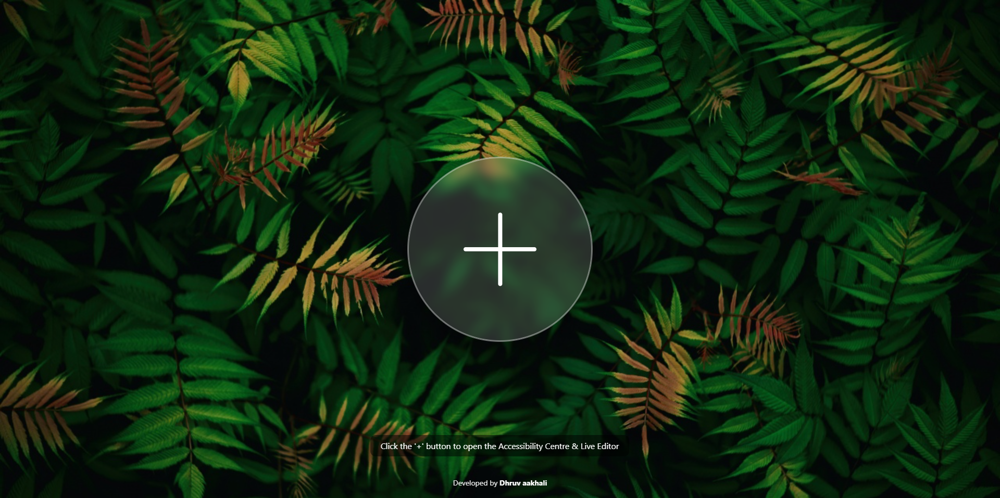
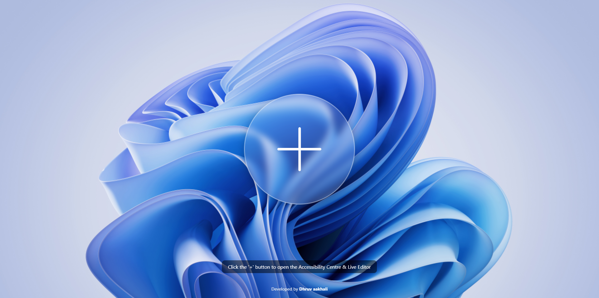
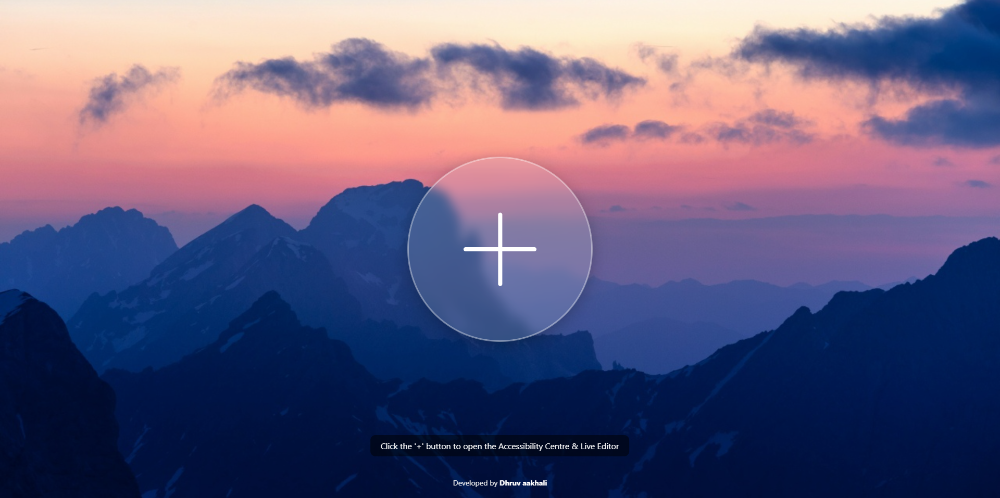
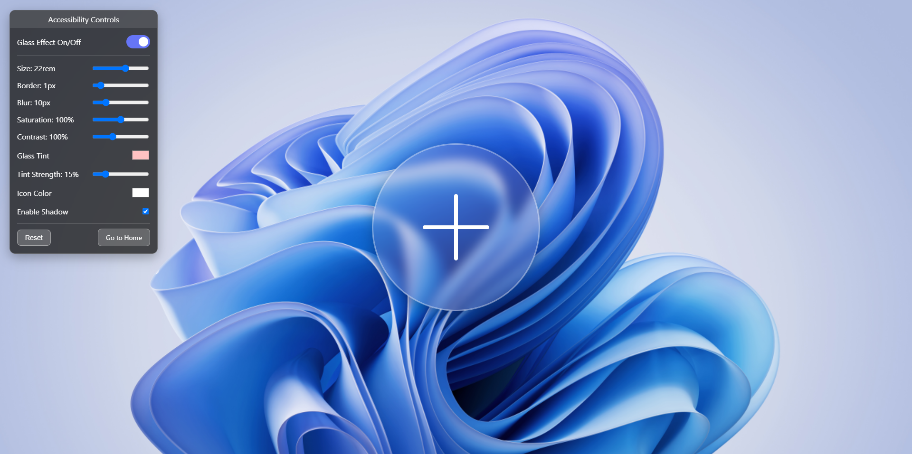

# Liquid Glass Effect - Interactive Demo & Accessibility Centre

  

This project is a web-based demonstration of a modern "liquid glass" or glassmorphism effect built with pure HTML, CSS, and JavaScript. It features two distinct pages: a clean static preview and a powerful interactive page with a draggable "Accessibility Centre" that allows for real-time customization of every visual property of the effect.

## 🚀 Live Demo

Experience the project live using the links below:

*   **[Static Preview Page](https://aakhalidhruv28.github.io/Liquid-Glass-Effect/index.html)**: A clean, static showcase of the glass effect.
*   **[Interactive Controls Page](https://aakhalidhruv28.github.io/Liquid-Glass-Effect/controls.html)**: The full experience with the accessibility panel to test and customize the effect in real time.

## 📸 Screenshots

Here is a preview of the project, showcasing the effect on different backgrounds and the interactive control panel.

| Static Preview (Leaves) | Static Preview (Windows) |
| :---: | :---: |
|  |  |

| Static Preview (Mountains) | Interactive Controls |
| :---: | :---: |
|  |  |

***Note:*** *To add your screenshots, create a folder named `screenshots` in your repository, add your images (e.g., `preview1.png`, `controls.png`), and update the paths above.*

## ✨ Features

*   **Modern Glassmorphism Effect**: A beautifully rendered frosted glass effect using CSS `backdrop-filter`.
*   **Two-Page Structure**:
    *   `index.html`: A static landing page to showcase the default effect.
    *   `controls.html`: An interactive playground for developers and designers.
*   **Draggable Control Panel**: The accessibility panel can be moved anywhere on the screen for an unobstructed view.
*   **Live, Real-Time Customization**: All changes are applied instantly without a page refresh.
*   **Comprehensive Accessibility & Visual Controls**:
    *   **On/Off Toggle**: Completely enable or disable the glass effect.
    *   **Size**: Dynamically change the height and width of the glass element.
    *   **Border**: Adjust the thickness of the subtle white border.
    *   **Blur**: Control the intensity of the background blur.
    *   **Saturation**: Modify the color vibrancy of the background seen through the glass, from full color to grayscale.
    *   **Contrast**: Adjust the contrast of the background to improve readability.
    *   **Glass Tint**: Apply a custom color tint to the glass.
    *   **Tint Strength**: Control the opacity of the color tint.
    *   **Icon Color**: Change the color of the '+' icon.
    *   **Shadow**: Toggle the `box-shadow` on and off.
*   **Reset to Defaults**: A handy "Reset" button to instantly revert all settings to their original state.
*   **Responsive Design**: The effect and layout are designed to work well on various screen sizes.

## 🛠️ Technologies Used

This project was built using front-end web technologies without any external libraries or frameworks.

*   **HTML5**: For the structure and content of the pages.
*   **CSS3**: For styling, layout, and the core glass effect.
    *   **`backdrop-filter`**: The key CSS property for creating the frosted glass look.
    *   **CSS Custom Properties (Variables)**: Used extensively to allow JavaScript to dynamically and efficiently update the styles in real time.
    *   **Flexbox & Grid**: For modern and robust layout management.
*   **JavaScript (ES6)**: To power the entire interactive experience.
    *   **DOM Manipulation**: To select and modify HTML elements and their styles.
    *   **Event Listeners**: To capture user input from sliders, color pickers, and checkboxes and trigger updates.

## 📁 File Structure

The repository is organized in a clean and easy-to-understand structure.

```
/
├── index.html       # The static preview page with instructions and footer.
├── controls.html    # The interactive page with the full control panel.
├── style.css        # Shared stylesheet for both HTML pages.
├── script.js        # JavaScript that powers the controls.html page.
└── README.md        # This file.
```

## ⚙️ How to Use Locally

To run this project on your local machine, follow these simple steps:

1.  **Clone the repository:**
    ```sh
    git clone https://github.com/aakhalidhruv28/Liquid-Glass-Effect.git
    ```
2.  **Navigate to the project directory:**
    ```sh
    cd Liquid-Glass-Effect
    ```
3.  **Open the files in your browser:**
    *   Simply double-click `index.html` or `controls.html` to open them in your local web browser. No web server or build steps are required.

## 📄 License

This project is distributed under the MIT License. See the `LICENSE` file for more information.

---

> **Developed by [Dhruv Aakhali](https://github.com/aakhalidhruv28/)**
